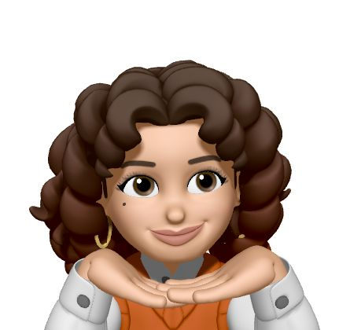

  

<h1 align="center">My data journey</h1>

Hello, I'm Claudia Guarino, a statistics student. Welcome to my world of data, I hope you enjoy!🌍🪐

.button {
  background-color: #4CAF50; /* Green */
  border: none;
  color: white;
  padding: 15px 32px;
  text-align: center;
  text-decoration: none;
  display: inline-block;
  font-size: 16px;
}
